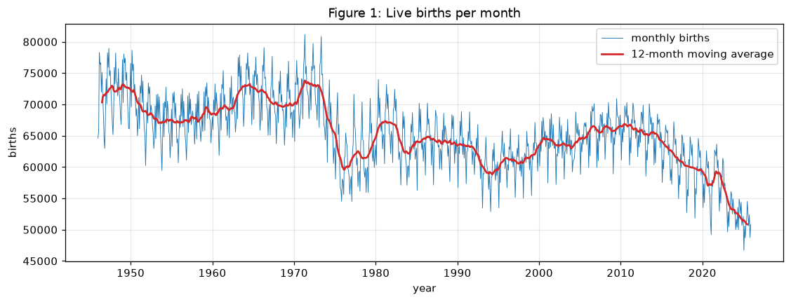
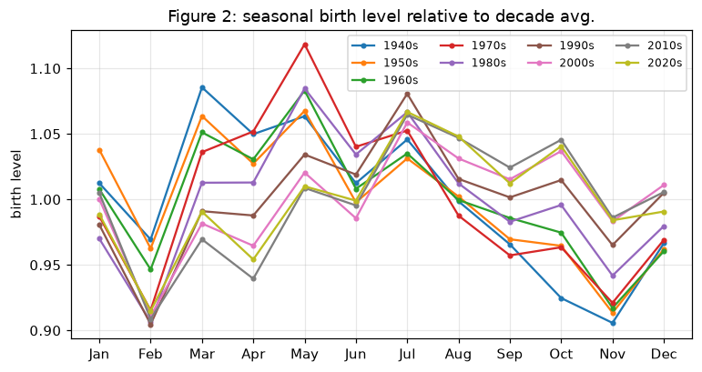
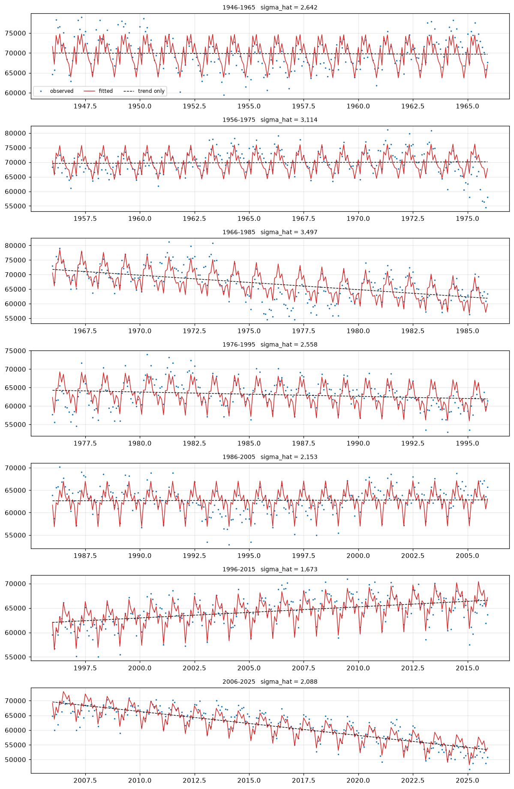

# Birth seasonality in Metropolitan France

This notebook looks at monthly live births in Metropolitan France from
1946 to 2025, focusing on the long-term trend and the seasonal pattern.

## Main findings

-   The number of births changes substantially over time. The overall
    level is much lower in the most recent years than in the post-war
    period, with several periods of decline and recovery.
-   There is a seasonal pattern. Births are generally higher in
    spring and summer and lower around February and November.
-   The seasonal pattern changes between decades. The relative
    size of the monthly effects is not constant over the whole period.
-   The rolling 20-year regressions capture the main seasonal cycle and
    broad trend, but the trend is quite different from one window to
    another. The 1996--2015 window slopes upward, while the most recent
    window has a marked downward trend.
-   The residuals still show substantial time dependence. The regression
    captures the regular seasonal pattern, but not all of the
    month-to-month variation.

Overall, the data show a strong seasonal cycle together with large
long-term changes in the number of births. The trend-plus-seasonality
regression is useful for describing these patterns, but it does not
capture all of the temporal structure in the series.

## Figures

### Monthly births over time

### Seasonal pattern by decade

### Rolling 20-year fitted models

